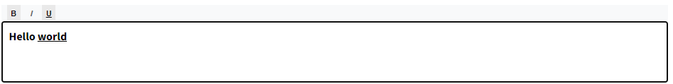

# Preact WYSIWYG Editor



A simple WYSIWYG (What You See Is What You Get) editor component for Preact, supporting basic text formatting options: bold, italic, and underline. This lightweight editor is perfect for applications that require basic text editing capabilities without the overhead of more complex libraries.

## How to Install

To install the `preact-wysiwyg-editor`, run the following command in your project directory:

```bash
npm install preact-wysiwyg-editor
```

## How to use
CommonJS (CJS) and ES Modules (ESM) support is available.
To use the preact-wysiwyg-editor in your Preact application, follow these steps:

1. Import the WysiwygEditor component from the package.
```tsx
import WysiwygEditor from 'preact-wysiwyg-editor';
```
2. Add the WysiwygEditor component to your component's render method or return statement.
```tsx
import WysiwygEditor from 'preact-wysiwyg-editor';

const App = () => {
  const [value, onChange] = useState('');

  return (
    <div>
      <WysiwygEditor value={value} onChange={onChange} />
      <div>
        <h2>Editor Content:</h2>
        <div dangerouslySetInnerHTML={{ __html: value }} />
      </div>
    </div>
  );
};

export default App;
```

## Playground in Preact environment
https://codepen.io/dannyb9737/pen/vYqOrpq